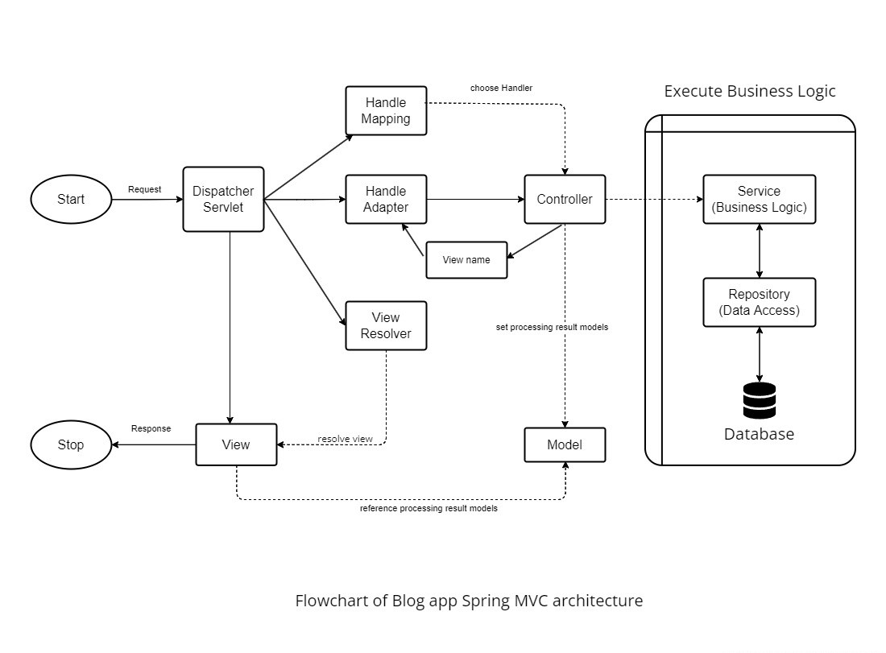

# Blog Site

## Description

A simple web application for blog site created using SpringBoot for backend as Maven project which integrates MySQL for database connection and React.js for frontend.

People can create account to add blogs.

- The app is created following Uncle Bob's clean code philosophy as much as possible.
- implemented Spring MVC architecture.
- Spring Security features for login/signup.
- Also uses JWT token based authorization feature.
<br/>

## Flowchart of app architecture


<br/>

## Use Case Diagram


A use case diagram is a graphical depiction of a user's possible interactions with a system. A use case diagram shows various use cases and different types of users the system has and will often be accompanied by other types of diagrams as well. The use cases are represented by either circles or ellipses. The user's interactions with the system are represented by arrows.

A use case diagram doesn't go into a lot of detail—for example, don't expect it to model the order in which steps are performed. Instead, a proper use case diagram depicts a high-level overview of the relationship between use cases, actors, and systems.
<br/>

## Prerequisites

- Java version 8+
- SpringBoot 2.2.x
- MySQL 8.0.18
- Spring version 5.2.x
- React version 16.8.x
- Node version 10.x
- NPM version 6.x
- Git version 2.x
- Maven Dependencies for pom.xml

  ```xml
        <dependencies>
        <dependency>
            <groupId>org.springframework.boot</groupId>
            <artifactId>spring-boot-starter-data-jpa</artifactId>
        </dependency>

        <dependency>
            <groupId>org.springframework.boot</groupId>
            <artifactId>spring-boot-starter-security</artifactId>
        </dependency>

        <dependency>
            <groupId>org.springframework.boot</groupId>
            <artifactId>spring-boot-starter-web</artifactId>
        </dependency>

        <dependency>
            <groupId>mysql</groupId>
            <artifactId>mysql-connector-java</artifactId>
            <scope>runtime</scope>
        </dependency>

        <dependency>
            <groupId>org.projectlombok</groupId>
            <artifactId>lombok</artifactId>
            <version>1.18.4</version>
            <scope>provided</scope>
        </dependency>

        <dependency>
            <groupId>io.jsonwebtoken</groupId>
            <artifactId>jjwt-api</artifactId>
            <version>0.10.5</version>
        </dependency>

        <dependency>
            <groupId>io.jsonwebtoken</groupId>
            <artifactId>jjwt-impl</artifactId>
            <scope>runtime</scope>
            <version>0.10.5</version>
        </dependency>

        <dependency>
            <groupId>io.jsonwebtoken</groupId>
            <artifactId>jjwt-jackson</artifactId>
            <scope>runtime</scope>
            <version>0.10.5</version>
        </dependency>

        <dependency>
            <groupId>org.springframework.boot</groupId>
            <artifactId>spring-boot-starter-test</artifactId>
            <scope>test</scope>
        </dependency>

        <dependency>
            <groupId>org.springframework.boot</groupId>
            <artifactId>spring-boot-starter-validation</artifactId>
        </dependency>

        <dependency>
            <groupId>org.springframework.security</groupId>
            <artifactId>spring-security-test</artifactId>
            <scope>test</scope>
        </dependency>
        <dependency>
            <groupId>org.springframework.boot</groupId>
            <artifactId>spring-boot-starter-security</artifactId>
        </dependency>

    </dependencies>
  ```

- Application.properties

 ```application.properties
    security.enable.csrf=false
    spring.main.allow-circular-references=true
    
    spring.datasource.url=jdbc:mysql://localhost:3306/blog  
    spring.datasource.username=${USERNAME} // instead of ${USERNAME} you may use a generic one as well, like 'root' but then it will be pushed to github with the app so anyone can see you username and password.
    spring.datasource.password=${PASSWORD}
    
    spring.jpa.hibernate.ddl-auto=update
    spring.jpa.show-sql=true
    spring.jpa.properties.hibernate.format_sql=true
    
    server.error.include-message=always
 ```
<br/>

## Running the Application

- Clone the repository to your local device.

  ```git
  git clone https://github.com/sthsuyash/Blog-Site.git
  ```

- Configure the Application.properties file.

  *in the place of* **USERNAME** *and* **PASSWORD** *, put your database username and password*

  ```properties
  spring.datasource.username=${USERNAME} 
  spring.datasource.password=${PASSWORD}
  ```

- Run the Application using IntelliJ IDEA or STS.

  ```mvn
  mvn clean package  
  ```

  ```mvn
  ./mvnw spring-boot:run
  ```
<br/>
  
## Contributing

To contribute to this app

- First, fork the repository. Now there will be a copy of this repo in your account.
- Clone the repository in your account and make changes to your local repo

  ```git
  git clone ${your_repo_url}
  ```
  
- To add features to the main repository, open Pull Request.
<br/>

## License

Copyright (c) 2012-2022 Scott Chacon and others

Permission is hereby granted, free of charge, to any person obtaining
a copy of this software and associated documentation files (the
"Software"), to deal in the Software without restriction, including
without limitation the rights to use, copy, modify, merge, publish,
distribute, sublicense, and/or sell copies of the Software, and to
permit persons to whom the Software is furnished to do so, subject to
the following conditions:

The above copyright notice and this permission notice shall be
included in all copies or substantial portions of the Software.

THE SOFTWARE IS PROVIDED "AS IS", WITHOUT WARRANTY OF ANY KIND,
EXPRESS OR IMPLIED, INCLUDING BUT NOT LIMITED TO THE WARRANTIES OF
MERCHANTABILITY, FITNESS FOR A PARTICULAR PURPOSE AND
NONINFRINGEMENT. IN NO EVENT SHALL THE AUTHORS OR COPYRIGHT HOLDERS BE
LIABLE FOR ANY CLAIM, DAMAGES OR OTHER LIABILITY, WHETHER IN AN ACTION
OF CONTRACT, TORT OR OTHERWISE, ARISING FROM, OUT OF OR IN CONNECTION
WITH THE SOFTWARE OR THE USE OR OTHER DEALINGS IN THE SOFTWARE.
<br/>

[Comment]: <> (## Citation)

## Contact

- sthasuyash11@gmail.com
- prashannabdrshrestha711@gmail.com
